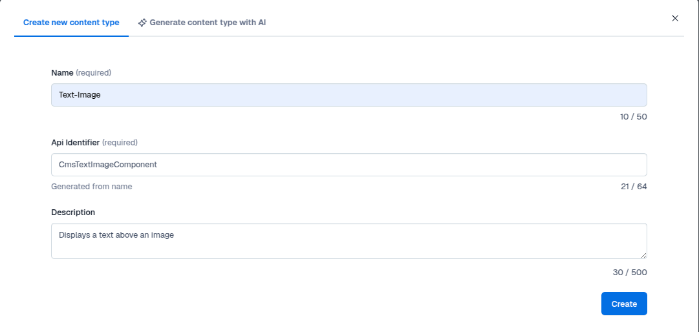
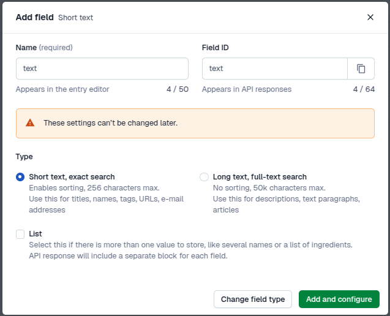
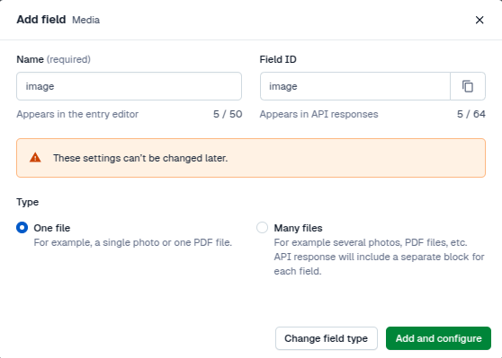
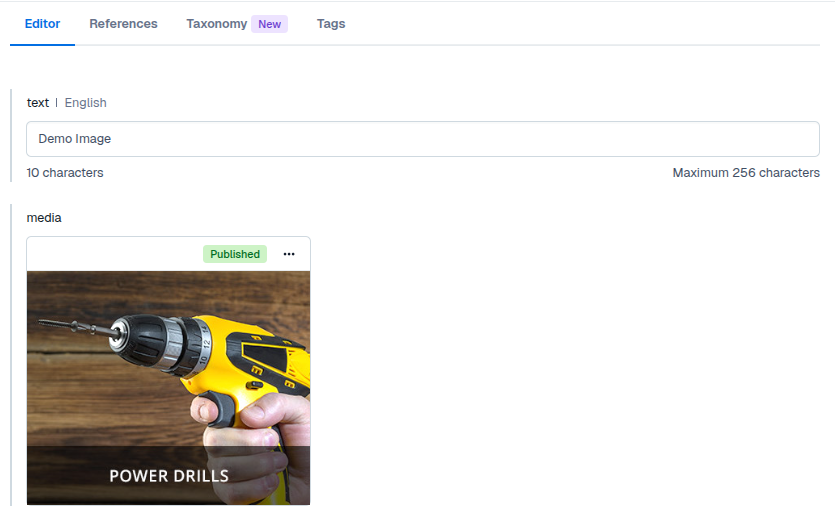
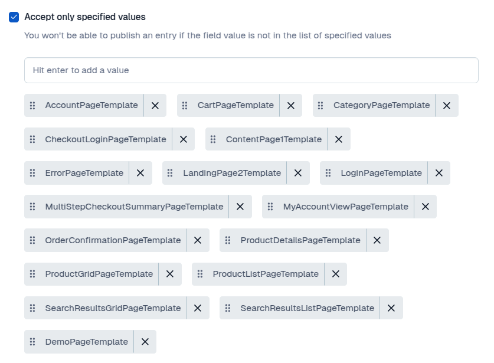
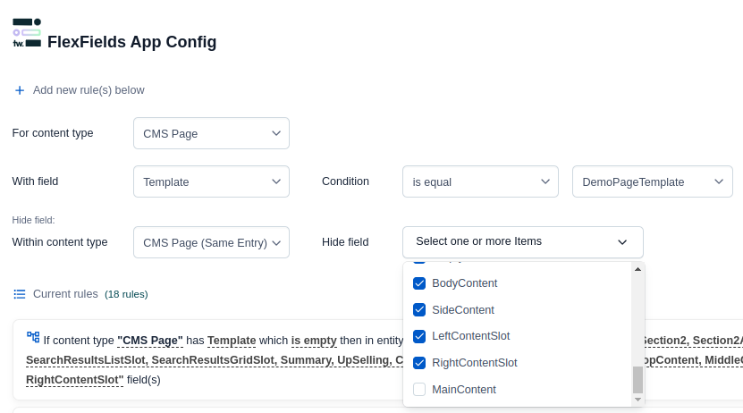
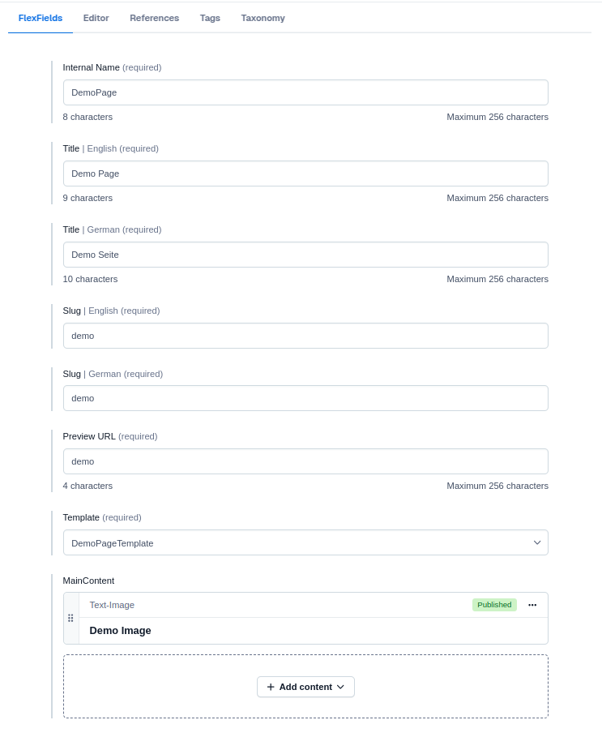
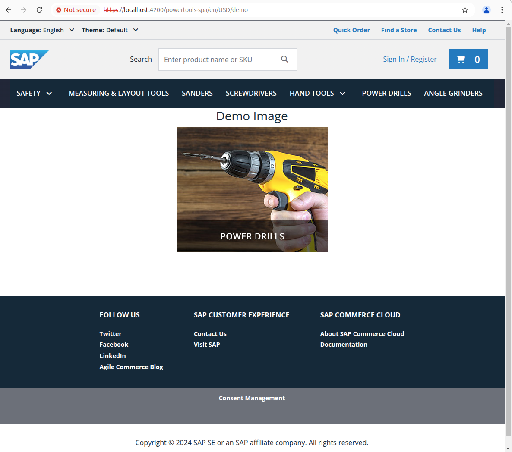

# Extending the Demo

## Creating a new component with custom fields

This guide will walk you through creating a new component with custom fields

### Composable Storefront

First you need to create the component in Composable Storefront.

#### Step 1: Define the Component Model

Create a model for the new component:

📁 `src/app/model/cms.model.ts`
```js[](https://help.sap.com/docs/SAP_COMMERCE_COMPOSABLE_STOREFRONT/eaef8c61b6d9477daf75bff9ac1b7eb4/f69db6d42d3449b7ae696f77d378c07f.html?q=page+layout#loio935971a85bc949c6b7d8bd7ce89e6750)
import { CmsComponent } from '@spartacus/core';
import { CmsBannerComponentMedia } from '@spartacus/core/src/model/cms.model';
export interface CmsTextImageComponent extends CmsComponent {
  text?: string;
  image?: CmsBannerComponentMedia;
}
```

#### Step 2: Create the Component

1. Create the Component File
📁 `src/app/cms-components/content/text-image/text-image.component.ts`
	```js
	import { ChangeDetectionStrategy, Component } from '@angular/core';
	import { CmsComponentData } from '@spartacus/storefront';
	import { CmsTextImageComponent } from '../../../model/cms.model';
	@Component({
	  selector: 'cx-text-image',
	  templateUrl: './text-image.component.html',
	  styleUrls: ['./text-image.component.scss'],
	  changeDetection: ChangeDetectionStrategy.OnPush,
	})
	export class TextImageComponent {
	  constructor(public component: CmsComponentData<CmsTextImageComponent>) {}
	}
	```

2. Create the Template File
📁 `src/app/cms-components/content/text-image/text-image.component.html`
	```html
	<div *ngIf="component.data$ | async as data" class="container">
	  <h2>{{data.text}}</h2>
	  
	</div>
	```

3. Create the Stylesheet
📁` src/app/cms-components/content/text-image/text-image.component.scss`
	```css
	.container {
	  display: flex;
	  flex-direction: column;
	  justify-content: center;
	  align-items: center;
	}
	```

4. Create a normalizer for the image
Since Contentful structures images differently, we need a normalizer to transform the image data into the format used in Angular.
📁 `src/app/cms-components/content/text-image/text-image-component-normalizer.ts`
	```js
	import { Injectable } from '@angular/core';
	
	import { CmsComponent } from '@spartacus/core';
	import { CmsBannerComponentMedia } from '@spartacus/core/src/model/cms.model';
	
	import { Asset, Entry } from 'contentful';
	
	import { ComponentSkeleton } from '../../../contentful/core/content-types';
	import { isAsset } from '../../../contentful/core/type-guards';
	import { CmsTextImageComponent } from '../../../model/cms.model';
	
	@Injectable({ providedIn: 'root' })
	export class TextImageComponentNormalizer {
	  convert(source: Entry<ComponentSkeleton, undefined, string>, target: CmsTextImageComponent): CmsComponent {
	    if (source.sys.contentType.sys.id === 'CmsTextImageComponent' && isAsset(source.fields?.['image'])) {
	      target.image = this.normalizeMediaAsset(source.fields['image']);
	    }
	    return target;
	  }
	
	  private normalizeMediaAsset(media: Asset<undefined, string>): CmsBannerComponentMedia | undefined {
	    return {
	      altText: '',
	      code: '',
	      mime: media.fields.file?.contentType ?? '',
	      url: media.fields.file?.url ?? '',
	    };
	  }
	}
	```

#### Step 3: Register the Component and inject the normalizer

Create a module to register the new component and provide the normalizer in Spartacus.

📁 `src/app/cms-components/content/text-image/text-image.module.ts`
```js
import { CommonModule, NgOptimizedImage } from '@angular/common';
import { NgModule } from '@angular/core';
import { CMS_COMPONENT_NORMALIZER, CmsConfig, provideDefaultConfig } from '@spartacus/core';
import { TextImageComponent } from './text-image.component';
import { TextImageComponentNormalizer } from './text-image-component-normalizer';

@NgModule({
  imports: [CommonModule, NgOptimizedImage],
  providers: [
    provideDefaultConfig(<CmsConfig>{
      cmsComponents: {
        CmsTextImageComponent: {
          component: TextImageComponent,
        },
      },
    }),
    {
      provide: CMS_COMPONENT_NORMALIZER,
      useExisting: TextImageComponentNormalizer,
      multi: true,
    },
  ],
  declarations: [TextImageComponent],
  exports: [TextImageComponent],
})
export class CmsTextImageModule {}
```

#### Step 4: Import the Module into the Spartacus Feature Module

Finally, add the new component module to the **Spartacus Feature Module**:

📁 `src/app/spartacus/spartacus-features.module.ts`

🔗 More details: [SAP Help - Creating a New Component](https://help.sap.com/docs/SAP_COMMERCE_COMPOSABLE_STOREFRONT/eaef8c61b6d9477daf75bff9ac1b7eb4/0bae2d8109d945d5a03743ed3f53ea7a.html#creating-a-new-component)

### Contentful
Now that we've created the component in **Composable Storefront**, the next step is to define the component template and content in **Contentful**.

#### Step 1: Create the Component Template

1. Open **Contentful**, go to **Content Models**, and click **Create Content Type**.
2. Fill in the required details:
	- **Name** (“Text-Image”)
	- **API Identifier** (“CmsTextImageComponent”)
	- **Description**
	- ⚠️ The **API Identifier** must match the name (“CmsTextImageComponent”) used when registering the component module in **Composable Storefront**.
	

3. Add two fields:
	- **Text**
		- Type: “Text” => “Short text, exact search”
		- Name: “text”
		- Field ID “text”
		

	- **Image**
		- Type: “Media” => “One file”
		- Name: “image”
		- Field ID “image”
		  

4. Click **Create** to save the new template.

#### Step 2: Create the New Component

Now, create a new component based on the template.



1. Create a new **Text-Image** content entry.

2. Add **text** and **image** values to be displayed in the component.

3. Click **Publish** to save and activate the component, including the image.

## Creating a New Page with a Custom Template

This guide will walk you through setting up a new page using a custom layout with new content slots.

### Composable Storefront

To add a new page with a custom template in Composable Storefront, you need to configure both the **layout** and the **routing**. Once set up, you'll provide these configurations to the Composable Storefront application.

#### Step 1: Configure the Layout
Create a custom layout configuration file:

📁` src/app/config/layout-config.ts`

```js
import { LayoutConfig } from '@spartacus/storefront';
export const layoutConfig: LayoutConfig = {
  layoutSlots: {
    DemoPageTemplate: {
      slots: ['MainContent'],
    },
  },
};
```

🔗 More details: [SAP Help - Page Layout](https://help.sap.com/docs/SAP_COMMERCE_COMPOSABLE_STOREFRONT/eaef8c61b6d9477daf75bff9ac1b7eb4/f69db6d42d3449b7ae696f77d378c07f.html?q=page+layout#loio935971a85bc949c6b7d8bd7ce89e6750)

#### Step 2: Configure Routing

Create a custom routing configuration file:

📁` src/app/config/routing-config.ts`

```js
import { RoutingConfig } from '@spartacus/core';
export const routingConfig: RoutingConfig = {
  routing: {
    routes: {
      demo: {
        paths: ['demo'],
      },
    },
  },
};
```

🔗 More details: [SAP Help - Routing](https://help.sap.com/docs/SAP_COMMERCE_COMPOSABLE_STOREFRONT/eaef8c61b6d9477daf75bff9ac1b7eb4/1406702864a24c55ae0daa50c5b590e7.html)

#### Step 3: Provide the Config to Composable Storefront

Create a new configuration module:

📁 `src/app/config/config.module.ts`

```js
import { NgModule } from '@angular/core';
import { provideConfig } from '@spartacus/core';
import { layoutConfig } from './layout-config';
import { routingConfig } from './routing-config';
@NgModule({
  providers: [provideConfig(layoutConfig), provideConfig(routingConfig)],
})
export class DemoConfigModule {}
```
Finally, import the `DemoConfigModule` in your `AppModule` to apply the configurations.

### Contentful

Now that we've configured the layout and routing, the next step is to define the page template and content slots in **Contentful**.

#### Step 1: Add the Page Template

1. Open **Contentful** and go to your **Content Models**.
2. Edit the **CMSPage** model.
3. Add the new template:
	- Find the **Template** field and edit it.
	- Under **Accept only specified values**, enter the name of the new template.
	
    - Click **Confirm** to save your changes.

#### Step 2: Add New Content Slots

1. In the **CMSPage** model, create a new field of type **Reference**
	1. **Name**: “MainContent”
	2. **Field ID**: “MainContent” (⚠️The **Field ID** must match the slot name from the layout configuration)
2. Choose **Many references**, allowing multiple components to be added to the slot.


#### Step 3: Add and Configure the New Slot

Use the **FlexFields app** from the **Contentful Marketplace** to manage slot selection.



1. Navigate to **Apps → Installed** and configure the app.
2. Add a new rule for the custom template:
	- Hide all content slots **except** the ones that should be part of the template.
3. Edit all other rules to **exclude** the newly created slots.

#### Step 4: Create the Content Page

Now that the new page template is ready, we can create a content page based on it.



1. Create a new **CMSPage** content entry.
2. Select the **Template** from the dropdown. This will display the available slots.
3. Fill in the required fields:
	- **Internal Name**: A name to identify the component.
	- **Title**: The headline displayed in the browser tab.
	- **Slug**: Must match the route set in the routing configuration, which in this example is “demo”
	- **Preview URL**: 
		- **For static pages**: Use a simple **slug** that matches the route.
			-  Example: `demo` → Accessible at `https://localhost:4200/demo`
		-  **For dynamic pages**: Use a **specific example** of the dynamic route.
			-  Example: `product/3755219/PSR%20960` → Previews a **product detail page** for a specific product
4. Add the previously created **Text-Image** component to the **MainContent** content slot.
5. **Publish the page.**

#### Step 5: Validate the Setup



1. Start the development server.
2. Navigate to your new route:
	- https://localhost:4200/powertools-spa/en/USD/demo
3. Confirm that the components appear correctly on the page.
