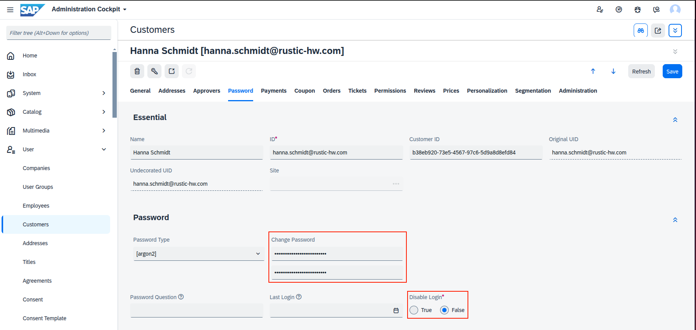
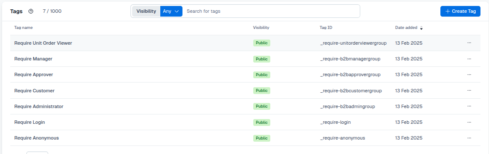
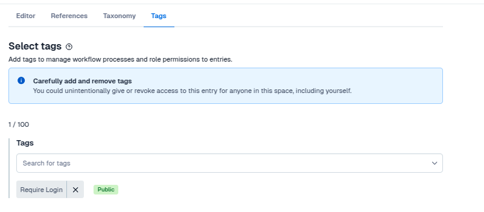

# Restriction Management System

## Component Restrictions

Some components in the composable storefront are restricted to certain users based on their authentication state and role.

### Authentication-Based Restrictions

- **My Account Menu**: Restricted to logged-in users.

- **Anonymous Consent Banner**: Restricted to anonymous users.

### Role-Based Restrictions

Navigation nodes in the My Account menu are further restricted based on user roles. The available roles are:

- **Customer**

- **Approver**

- **Manager**

- **Unit Level Order Viewer**

- **Administrator**

### Component to Role and State Mapping

| Component | Restricted To | 
|---|---|
| Anonymous Consent Management Banner | Anonymous | 
| Anonymous Consent Management Open Dialog | Anonymous |
| My Account | Login |
| PaymentDetailsLink | Customer |
| OrderHistoryLink | Customer |
| AddressBookLink | Customer |
| ApprovalDashboardLink | Approver |
| MyCompanyLink | Administrator |
| UnitLevelOrderLink | Unit Level Order Viewer |

### Backoffice Configuration

To enable user login:
1. Navigate to **Customers** and select the **Password** tab.
2. Set a password for the user.
3. Set **Disable Login** to **false**.

These users need to be activated to access all B2B functionality:

| Email | Role(s) |
| --- | --- |
| linda.wolf@rustic-hw.com | Administrator |
| hanna.schmidt@rustic-hw.com | Approver, Unit Level Order Viewer |
| william.hunter@rustic-hw.com | Customer |
| matheu.silva@rustic-hw.com | Manager |

### Contentful Configuration

- For each role, a **tag** was created and will be imported during the [Getting Started](./getting-started.md) setup. 
- To restrict a component to a specific role, add the respective tag to the component.

- The connector will ensure that components are only displayed to users with the matching role tag.
